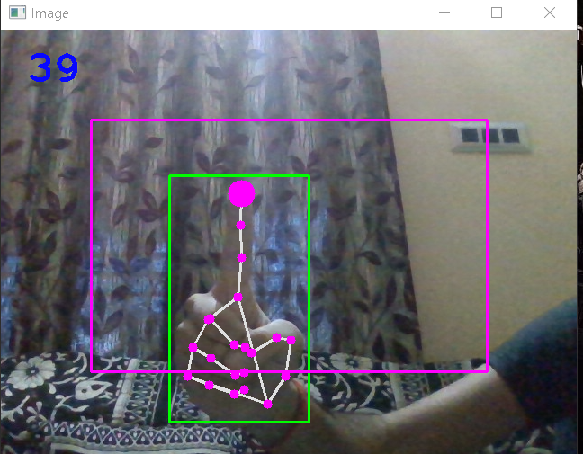

<div id="top"></div>


<!-- PROJECT LOGO -->
<br />
<div align="center">
  <a href="https://github.com/acm-iem/VirtualMouse">
    
  </a>

  <h3 align="center">Virtual Mouse</h3>

  <p align="center">
    Why need a physical mouse, when you have you Hands !
    <br />
    <a href="https://github.com/acm-iem/VirtualMouse"><strong>Explore the docs »</strong></a>
    <br />
    <br />
    <a href="https://github.com/acm-iem/Dseized-Bot">View Demo</a> 
    ·
    <a href="https://github.com/acm-iem/VirtualMouse/issues">Report Bug</a>
    ·
    <a href="https://github.com/acm-iem/virtualMouse/issues">Request Feature</a>
  </p>
</div>


<!-- TABLE OF CONTENTS -->
<details>
  <summary>Table of Contents</summary>
  <ol>
    <li>
      <a href="#about">About The Project</a>
      <ul>
        <li><a href="#built">Built With</a></li>
        <li><a href="#prerequisites">Prerequisites</a></li>
        <li><a href="#installing-dependencies">Installing Dependencies</a></li>
      </ul>
    </li>
    <li><a href="#roadmap">Roadmap</a></li>
    <li><a href="#contributions">Contributing</a></li>
    <li><a href="#license">License</a></li>
  </ol>
</details>

<!-- ABOUT THE PROJECT -->
<div id="about"></div>

# AI Virtual Mouse

 <strong>No Physical Mouse, just your hands and you are good to go for browsing and scrolling ,easily and smoothly. <strong><br>
#### **Yes, you heard it right!**<br>
>Our team Developed an AI-based approach for controlling the mouse movement using Python and openCV with real-time camera that detects hand landmarks, tracks gesture patterns instead of a physical mouse.

This repository contains all of the code required **NOTE** you may need to download other dependencies which will be mentioned below. 
## Features
#### ***This virtual mouse comes with features like :*** <br>
* You can move the cursor using just index finger(by pointing it towards the camera and moving it accordingly). 
<div align="centre">
  <a href="https://github.com/acm-iem/VirtualMouse">
    
  </a>
  <br>
  <br>
  <br>
</div>

* You can select any file or folder using your middle and index finger together(As the distance between two fingers comes in short range,the cursor selects that particular thing).
<div align="centre">
  <a href="https://github.com/acm-iem/VirtualMouse">
    
  </a>
  <br>
  <br>
  <br>
</div>
   
Make sure you have [**Python**](https://python.org) installed on your computer before continuing.

<p align="right">(<a href="#top">back to top</a>)</p>


<div id="built"></div>
   
### Built With

[Python](https://python.org)


<p align="right">(<a href="#top">back to top</a>)</p>
<div id="prerequisites"></div>
   
### Prerequisites
 
* Python (Preferablyy version 3.8 or 3.7)
* A Web-camera


<p align="right">(<a href="#top">back to top</a>)</p>
<div id="installing-dependencies"></div>
   
## Dependencies  -
> Please install all the required dependencies/modules.
* openCV - (For image processing and drawing)
* mediapipe - (For Hand Tracking)
* autopy - (For controlling the mouse movement and click)
* numpy<br>
#### **NOTE** :-
   * Autopy module is not supported in python versions 3.9 or above(you may face error in installing).<br>
   So try to install these modules in python version 3.8 or 3.7(more stable).
## Installation

To setup the system for development on your local machine, please follow the instructions below:

1. Clone the repository to your machine

   ```bash
   git clone https://github.com/itisdb/Virtual-Mouse.git
   ```

2. Run the ```AIVirtualMouse.py``` python file.


<p align="right">(<a href="#top">back to top</a>)</p>
<div id="roadmap"></div>
   
<!-- ROADMAP -->
## Roadmap

- [ ] Add more smoothness in performing operations
- [ ] Making this project to work on global level

See the [open issues](https://github.com/acm-iem/VirtualMouse/issues) for a full list of proposed features (and known issues).
  <br> To propose a new feature open an [issue](https://github.com/acm-iem/VirtualMouse/issues) in issues section.

<p align="right">(<a href="#top">back to top</a>)</p>


<div id="contributions"></div>
   
<!-- CONTRIBUTING -->
## Contributions

### **For contributing to this project, kindly read rules mentioned in [Contributing.md](Contributing.md) file.**<br>
Contributions are what make the open source community such an amazing place to learn, inspire, and create. Any contributions you make are **greatly appreciated**.

If you have a suggestion that would make this better, please fork the repo and create a pull request. You can also simply open an issue with the tag "enhancement".
Don't forget to give the project a star! Thanks again!

1. Fork the Project
2. Create your Feature Branch (`git checkout -b feature/AmazingFeature`)
3. Commit your Changes (`git commit -m 'Add some AmazingFeature'`)
4. Push to the Branch (`git push origin feature/AmazingFeature`)
5. Open a Pull Request

<p align="right">(<a href="#top">back to top</a>)</p>


<div id="license"></div>
   
<!-- LICENSE -->
## License

Distributed under the MIT License. See `LICENSE.txt` for more information.

<p align="right">(<a href="#top">back to top</a>)</p>
